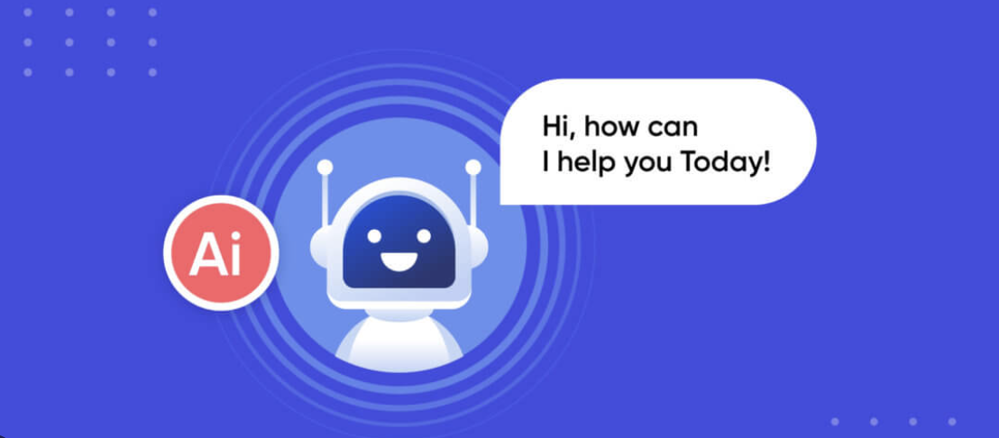
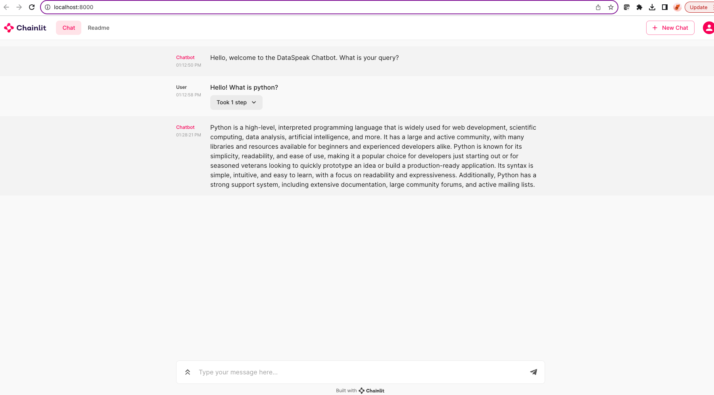
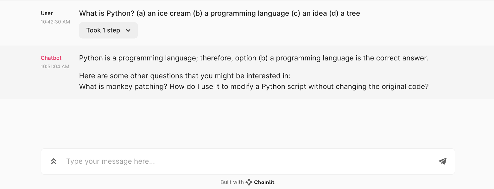

## Generative Answer Chat Bot

<p align="center">
  
</p>

**Background**: A project for <a href="https://dataspeak.co/about" target="_blank">DataSpeak</a>, a data science consulting firm, to develop an AI customer service chatbot that could be used across multiple clients. This chatbot learns from a dataset and answer questions on domain-specific knowledge. 

**Purpose**: There were three goals for the chatbot:    
 1. Generate answers to user questions
 2. Pull information from a domain specific dataset  
 3. Produce accurate answers  

**Techniques**: RAG Llama-2, LangChain, LLMs  

[View Project Code](https://github.com/kellyshreeve/QA-Chatbot/blob/main/final_chainlit_app.py)

### Examples  

##### Open-Ended Question Answering  

The model accurately responds to open-ended questions with information from the dataset in under 5min on GPU.

<p align="center">
  
</p>

##### Multiple-Choice Question Answering

The model correctly picks from a list of multiple choice questions, displaying accuracy when answering customer questions.

<p align="center">
  
</p>


### Getting Started  

```final_chainlit_app.py```
1. Register to use Llama-2 on Meta.
2. Get a Hugging Face API Key and add to config.py file.
3. Install requirements.txt
4. Link in a new context dataset
5. Run chainlit locally through terminal:  
```chainlit run final_chainlit_app.py```

UPDATED: ```chainlit_app.py```
1. Register to use Llama-2 on Meta.
2. Get a Hugging Face API Key.
3. Create a .env file and add your API key:  
```HUGGING_FACE_KEY='YOUR KEY HERE'```
3. Install requirements.txt
4. Link in a new context dataset
5. Run chainlit locally through terminal:  
```chainlit run chainlit_app.py```


### Data  

#### Data Acquisition  

Data for this project came from a public dataset of python questions and answers from Kaggle.  

Data Link: https://www.kaggle.com/datasets/stackoverflow/pythonquestions  

#### Data Preparation  

1. Datasets were cleaned of html text, special characters, and capital letters.  
2. Question and answer datasets were merged into one questions-answer dataframe on Id column.  
3. Answers from a sample of 100,000 question-answer pairs were used as a context document for model development.  

### Further Research and Development

This model should be tested on each domain-specific dataset to ensure it is able to learn accurate answers to common customer questions. Additionally response times can be sped up by running the app through GPU and vector storage in Pinecone. This app will can be deployed over a web service for use by customers.


[View Project Code](https://github.com/kellyshreeve/QA-Chatbot/blob/main/final_chainlit_app.py)
